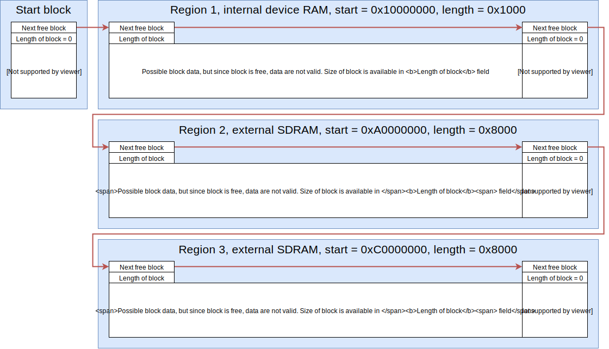
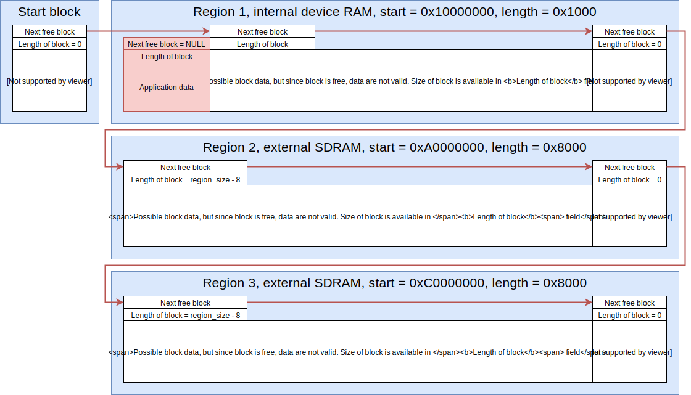

.. _how_it_works:

How it works
============

This section shows different buffer corner cases and provides basic understanding how memory allocation works within firmware.

As it is already known, library supports multiple memory regions (or addresses) to allow multiple memory locations within embedded systems:

* Internal RAM memory
* External RAM memory
* Optional fragmented internal memory

For the sake of this understanding, application is using ``3`` regions

* Region ``1`` memory starts at ``0x1000 0000`` and is ``0x0000 1000`` bytes long
* Region ``2`` memory starts at ``0xA000 0000`` and is ``0x0000 8000`` bytes long
* Region ``3`` memory starts at ``0xC000 0000`` and is ``0x0000 8000`` bytes long

.. note::
    Total size of memory used by application for memory manager is ``0x0001 1000`` bytes or ``69 kB``.
    This is a sum of all ``3`` regions.

Example also assumes that:

* Size of any kind of pointer is ``4-bytes``, ``sizeof(any_pointer_type) = 4``
* Size of ``size_t`` type is ``4-bytes``, ``sizeof(size_t) = 4``

First step is to define custom regions and assign them to memory manager.

.. literalinclude:: ../examples/example_regions_definitions.c
    :language: c

.. note::
    Order of regions must be lower address first. Regions must not overlap with their sizes.

When calling ``lwmem_assignmem``, manager prepares memory blocks and assigns default values.

    Default memory structure after initialization

Memory managers sets some default values, these are:

* All regions are connected through single linked list. Each member of linked list represents free memory slot
* Variable ``Start block`` is by default included in library and points to first free memory on the list
* Each region has ``2 free slot`` indicators

  * One at the end of each region. It takes ``8 bytes`` of memory:
  
    * Size of slot is set to ``0`` which `means no available memory`
    * Its next value points to next free slot in another region. Set to ``NULL`` if there is no free slot available anymore after and is *last region* indicator
  
  * One at the beginning of region. It also takes ``8 bytes`` of memory:
  
    * Size of slot is set to ``region_size - 8``, ignoring size of last slot. Effective size of memory, application may allocate in region, is always for ``2`` meta slots less than region size, which means ``max_app_malloc_size = region_size - 2 - 8 bytes``
    * Its next value points to end slot in the same region

When application tries to allocate piece of memory, library will check linked list of empty blocks until it finds first with sufficient size. If there is a block bigger than requested size, it will be marked as allocated and removed from linked list.

.. note:: 
    Further optimizations are implemented, such as possibility to split block when requested size is smaller than empty block size is.

    Memory structure after first allocation

* Light red background slot indicates memory in use.
* All blocks marked in use have

  * ``next`` value is set to ``NULL``
  * ``size`` value has MSB bit set to ``1``, indicating block *is allocated* and the rest of bits represent size of block, including metadata size
  * If application asks for 8 bytes, fields are written as ``next = 0x0000 0000`` and ``size = 0x8000 000F``

* ``Start block`` now points to free slot somewhere in the middle of region

.. figure:: ../static/images/structure_alloc_free_steps.svg
    :align: center
    :alt: Step-by-step memory structure after multiple allocations and deallocations

    Step-by-step memory structure after multiple allocations and deallocations

Image shows only first region to simplify process. Same procedure applies to other regions too.

* ``Case A``: Second block allocated. Remaining memory is now smaller and ``Start block points`` to it
* ``Case B``: Third block allocated. Remaining memory is now smaller and ``Start block points`` to it
* ``Case C``: Forth block allocated. Remaining memory is now smaller and ``Start block points`` to it
* ``Case D``: Third block freed and added back to linked list of free slots.
* ``Case E``: Forth block freed. Manager detects blocks before and after current are free and merges all to one big contiguous block
* ``Case F``: First block freed. ``Start block`` points to it as it has been added back to linked list
* ``Case G``: Second block freed. Manager detects blocks before and after current are free and merges all to one big contiguous block.
  
  * No any memory allocated anymore, regions are back to default state

.. toctree::
    :maxdepth: 2