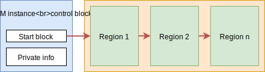

.. _lwmem_instances:

LwMEM instances
===============

LwMEM architecture allows multiple instances, to completely isolate memory management between different memories.
This may allow separation of memory management at hardware level with different security feature.

By default, LwMEM has single instance created at library level, called *default instance*.
Default instance does not need any special attention as it is embedded at library core,
instead application has to assign memory regions for the instance.

Every instance has:

* Instance control block
* Multiple regions assigned to each instance

.. note::
    Control block of default instance is already initialized by library core,
    hence it does not need any special attention at application layer.

    LwMEM internal architecture with control block

Picture above shows internal architecture of LwMEM. 
Control block holds info about first free block for allocation and other private data,
such as mutex handle when operating system is in use.

Yellow part of the image shows customized, application-defined, regions,
which must be manually assigned to the instance during application start-up.

Known example for assinging regions to LwMEM is shown below.
Default instance is used, therefore no special attention needs to be added
when assigning regions or allocating memory.

.. literalinclude:: ../examples_src/example_regions_definitions.c
    :language: c
    :linenos:
    :caption: Definition and assignment of regions for default LwMEM instance

When application adds second LwMEM instance, then special functions with `_ex` must be used.
These allow application to specify for which LwMEM instance specific operation is intended.

.. tip::
	Check :cpp:func:`lwmem_assignmem_ex` description for more information about input parameters.

.. literalinclude:: ../examples_src/example_regions_definitions_custom.c
    :language: c
    :linenos:
    :caption: Definition and assignment of regions for custom LwMEM instance

.. toctree::
    :maxdepth: 2
