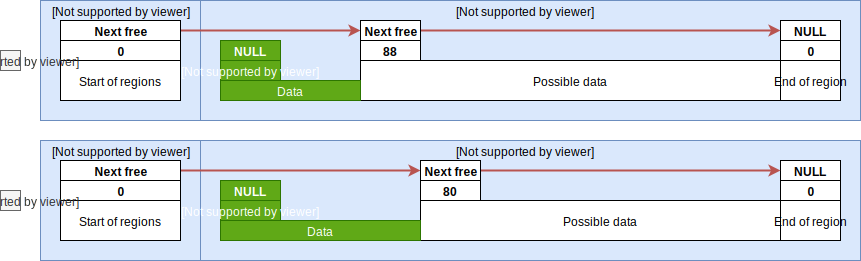

.. _realloc_algorithm:

Reallocation algorithm
======================

What makes this library different to others is its ability for memory re-allocation.
This section explains how it works and how it achieves best performances and less memory fragmentation vs others.

Sometimes application uses variable length of memory,
especially when number of (as an example) elements in not fully known in advance.
For the sake of this example, application anticipates ``12`` numbers (`integers`) but may (due to unknown reason in some cases) receive more than this.
If application needs to hold all received numbers, it may be necessary to:

* Option ``1``: Increase memory block size using reallocations
* Option ``2``: Use very big (do we know how big?) array, allocated statically or dynamically, which would hold all numbers at any time possible

.. note:: 
    LwMEM has been optimized to handle well option ``1``.

Application needs to define at least single region:

.. literalinclude:: ../examples_src/example_realloc_region.c
    :language: c
    :linenos:
    :caption: Memory region assignment

When executed on test machine, it prints:

.. literalinclude:: ../examples_src/example_realloc_region_log.c
    :caption: Memory region assignment output

.. note:: 
    Please check :ref:`how_it_works` section for more information

After region has been defined, application tries to allocate memory for ``12 integers``.

.. literalinclude:: ../examples_src/example_realloc_first_malloc.c
    :language: c
    :linenos:
    :caption: First memory allocation

When executed on test machine, it prints:

.. literalinclude:: ../examples_src/example_realloc_first_malloc_log.c
    :caption: First memory allocation output

At first, manager had ``120`` bytes of available memory while after allocation of ``48`` bytes, it only left ``64`` bytes.
Effectively ``120 - 64 = 56`` bytes have been used to allocate ``48`` bytes of memory.

.. note::
    Every allocated block holds meta data. On test machine, ``sizeof(int) = 4`` therefore ``8`` bytes are used for metadata as ``56 - 12 * sizeof(int) = 8``. Size of meta data header depends on CPU architecture and may be different between architectures

Application got necessary memory for ``12`` integers. How to proceed when application needs to extend size for one more integer?

Easiest would be to:

#. Allocate new memory block with new size and check if allocation was successful
#. Manually copy content from old block to new block
#. Free old memory block
#. Use new block for all future operations

Here is the code:

.. literalinclude:: ../examples_src/example_realloc_custom_realloc.c
    :language: c
    :linenos:
    :caption: Custom reallocation

When executed on test machine, it prints:

.. literalinclude:: ../examples_src/example_realloc_custom_realloc_log.c
    :caption: Custom reallocation output

Outcome of the debug messages:

#. Memory was successfully allocated for ``12`` integers, it took ``56`` bytes
#. Memory was successfully allocated for another ``13`` integers , it took ``64`` bytes
#. There is no more free memory available
#. First ``12`` integers array was successfully freed, manager has ``56`` bytes of free memory
#. Second ``13`` integers block was successfully freed, manager has all ``120`` bytes available for new allocations

This was therefore successful custom reallocation from ``12`` to ``13`` integers.
Next step is to verify what would happen when application wants to reallocate to ``15`` integers instead.
When same code is executed (but with ``15`` instead of ``12``), it prints:

.. literalinclude:: ../examples_src/example_realloc_custom_realloc_log_2.c
    :caption: Custom reallocation for 15 integers

Oooops! It is not anymore possible to allocate new block for new ``15`` integers as there was no available block with at least ``15 * sizeof(int) + metadata_size`` bytes of free memory.

.. note:: 
    With this reallocation approach, maximal size of application block is only ``50%`` of region size. This is not the most effective memory manager!

Fortunately there is a solution. Every time application wants to resize existing block, manager tries to manipulate existing block and shrink or expand it.

Shrink existing block
^^^^^^^^^^^^^^^^^^^^^

Easiest reallocation algorithm is when application wants to decrease size of previously allocated memory.
When this is the case, manager only needs to change the size of existing block to lower value.

.. literalinclude:: ../examples_src/example_realloc_shrink.c
    :language: c
    :linenos:
    :caption: Shrink existing block to smaller size

When executed on test machine, it prints:

.. literalinclude:: ../examples_src/example_realloc_shrink_log.c
    :caption: Shrink existing block to smaller size output

Outcome of our reallocation:

* Memory was successfully allocated for ``15`` integers, it took ``68`` bytes; part ``A`` on image
* Memory was successfully re-allocated to ``12`` integers, now it takes ``56`` bytes, part ``B`` on image
* In both cases on image, final returned memory points to the same address

  * Manager does not need to copy data from existing memory to new address as it is the same memory used in both cases

* Empty block start address has been modified and its size has been increased, part ``B`` on image
* Reallocated block was successfully freed, manager has all ``120`` bytes for new allocations

.. tip:: 
    This was a success now, much better.

It is not always possible to increase block size of next free block on linked list.
Consider new example and dedicated image below.

.. figure:: ../static/images/structure_realloc_shrink_fragmented.svg
    :align: center
    :alt: Shrinking fragmented memory block

    Shrinking fragmented memory block

.. literalinclude:: ../examples_src/example_realloc_shrink_fragmented.c
    :language: c
    :linenos:
    :caption: Shrink fragmented memory block

When executed on test machine, it prints:

.. literalinclude:: ../examples_src/example_realloc_shrink_fragmented_log.c
    :caption: Shrink fragmented memory block output

Outcome of this example:

* Size of all ``4`` blocks is ``24`` bytes; ``16`` for user data, ``8`` for metadata
* Reallocating block first time from ``16`` to ``12`` user data bytes did not affect internal memory structure
  
  * It is not possible to create new empty block as it would be too small, only ``4`` bytes available, minimum is ``8`` bytes for meta data
  * It is not possible to enlarge next empty block due to *current* and *next empty* do not create contiguous block
  * Block is internally left unchanged

* Reallocating block second time to ``8`` bytes was a success
  
  * Difference between old and new size is ``8`` bytes which is enough for new empty block

    * Its size is ``8`` bytes, effectively ``0`` for user data due to meta size

Shrink existing block - summary
*******************************

When reallocating already allocated memory block, one of `3` cases will happen:

* Case ``1``: When *current* block and *next free* block could create contigouos block of memory, *current* block is decreased (size parameter) and *next free* is enlarged by the size difference
* Case ``2``: When difference between *current* size and *new* size is more or equal to minimal size for new empty block, new empty block is created with size ``current_size - new_size`` and added to list of free blocks
* Case ``3``: When difference between *current* size and *new* size is less than minimal size for new empty block, block is left unchanged

Enlarge existing block
^^^^^^^^^^^^^^^^^^^^^^

Now that you master procedure to shrink (or decrease) size of existing allocated memory block, it is time to understand how to enlarge it.
Things here are more complicated, however, they are still easy to understand.

Manager covers ``3`` potential cases:

* Case ``1``: Increase size of currently allocated block
* Case ``2``: Merge previous empty block with existing one and shift data up
* Case ``3``: Block before and after existing block together create contiguous block of memory

*Free block* after + *allocated block* create one big contiguous block
**********************************************************************

    *Free block* after + *allocated block* create one big contiguous block

.. literalinclude:: ../examples_src/example_realloc_enlarge_1.c
    :language: c
    :linenos:
    :caption: Enlarge existing block

When executed on test machine, it prints:

.. literalinclude:: ../examples_src/example_realloc_enlarge_1_log.c
    :caption: Enlarge existing block output

* Allocation for first block of memory (``24`` user bytes) uses ``32`` bytes of data
* Reallocation is successful, block has been extended to ``40`` bytes and next free block has been shrinked down to ``80`` bytes

*Free block* before + *allocated block* create one big contiguous block
***********************************************************************

.. figure:: ../static/images/structure_realloc_enlarge_2.svg
    :align: center
    :alt: *Free block* before + *allocated block* create one big contiguous block

    *Free block* before + *allocated block* create one big contiguous block

.. literalinclude:: ../examples_src/example_realloc_enlarge_2.c
    :language: c
    :linenos:
    :caption: Enlarge existing block

When executed on test machine, it prints:

.. literalinclude:: ../examples_src/example_realloc_enlarge_2_log.c
    :caption: Enlarge existing block output

* First application allocates big block (``88`` bytes), followed by smaller block (``32`` bytes)
* Application then frees big block to mark it as free. This is effectively state ``2a``
* During reallocation, manager did not find suitable block after *current* block, but it found suitable block before *current* block:

  * Empty block and allocated block are temporary merged to one big block (``120`` bytes)
  * Content of allocated block is shifted up to beginning of new big block
  * Big block is then splitted to required size, the rest is marked as free

* This is effectively state ``2b``

*Free block* before + *free block* after + *allocated block* create one big contiguous block
********************************************************************************************

When application makes many allocations and frees of memory, there is a high risk of memory fragmentations.
Essentially small chunks of allocated memory prevent manager to allocate new, fresh, big block of memory.

When it comes to reallocating of existing block, it may happen that *first free block after* and *current block* create a contiguous block, but its combined size is not big enough. Same could happen with *last block before* + *current block*. However, it may be possible to combine *free block before* + *current block* + *free block after* current block together.

.. figure:: ../static/images/structure_realloc_enlarge_3.svg
    :align: center
    :alt: *Free block* before + *free block* after + *allocated block* create one big contiguous block

    *Free block* before + *free block* after + *allocated block* create one big contiguous block

In this example manager has always ``2`` allocated blocks and application always wants to reallocate ``green`` block.
``Red`` block is acting as an obstacle to show different application use cases.

.. note::
    Image shows ``4`` use cases. For each of them, case labeled with ``3`` is initial state.

Initial state ``3`` is generated using C code:

.. literalinclude:: ../examples_src/example_realloc_enlarge_3.c
    :language: c
    :linenos:
    :caption: Initial state of blocks within memory

When executed on test machine, it prints:

.. literalinclude:: ../examples_src/example_realloc_enlarge_3_log.c
    :caption: Initial state of blocks within memory output

.. tip::
    Image shows (and log confirms) ``3`` free slots of ``16, 12 and 56`` bytes in size respectively.

* Case ``3a``: Application tries to reallocate green block from ``12`` to ``16`` bytes

  * Reallocation is successful, there is a free block just after and green block is successfully enlarged
  * Block after is shrinked from ``12`` to ``8`` bytes
  * Code example (follows initial state code example)
  
  .. literalinclude:: ../examples_src/example_realloc_enlarge_3a.c
    :language: c
    :linenos:
    :caption: Enlarge of existing block for case 3A

  * When executed on test machine, it prints:

  .. literalinclude:: ../examples_src/example_realloc_enlarge_3a_log.c
    :caption: Enlarge of existing block for case 3A output

* Case ``3b``: Application tries to reallocate green block from ``12`` to ``28`` bytes

  * Block after green is not big enough to merge them to one block (``12 + 12 < 28``)
  * Block before green is big enough (``16 + 12 >= 28``)
  * Green block is merged with previous free block and content is shifted to the beginning of new block
  
  .. literalinclude:: ../examples_src/example_realloc_enlarge_3b.c
    :language: c
    :linenos:
    :caption: Enlarge of existing block for case 3B

  - When executed on test machine, it prints:

  .. literalinclude:: ../examples_src/example_realloc_enlarge_3b_log.c
    :caption: Enlarge of existing block for case 3B output

* Case ``3c``: Application tries to reallocate green block from ``12`` to ``32`` bytes

  * Block after green is not big enough to merge them to one block (``12 + 12 < 32``)
  * Block before green is also not big enough (``12 + 16 < 32``)
  * All three blocks together are big enough (``16 + 12 + 12 >= 32``)
  * All blocks are effectively merged together and there is a new temporary block with its size set to ``40`` bytes
  * Content of green block is shifted to the beginning of new block
  * New block is limited to ``32`` bytes, keeping ``8`` bytes marked as free at the end
  
  .. literalinclude:: ../examples_src/example_realloc_enlarge_3c.c
    :language: c
    :linenos:
    :caption: Enlarge of existing block for case 3C

  * When executed on test machine, it prints:

  .. literalinclude:: ../examples_src/example_realloc_enlarge_3c_log.c
    :caption: Enlarge of existing block for case 3C output

* Case ``3d``: Application tries to reallocate green block from ``12`` to ``44`` bytes

  * None of the methods (``3a - 3c``) are available as blocks are too small
  * Completely new block is created and content is copied to it
  * Existing block is marked as free. All ``3`` free blocks create big contiguous block, they are merged to one block with its size set to ``40``
  
  .. literalinclude:: ../examples_src/example_realloc_enlarge_3d.c
    :language: c
    :linenos:
    :caption: Enlarge of existing block for case 3D

  * When executed on test machine, it prints:

  .. literalinclude:: ../examples_src/example_realloc_enlarge_3d_log.c
    :caption: Enlarge of existing block for case 3D output

Full test code with assert
**************************

Advanced debugging features have been added for development purposes.
It is now possible to simulate different cases within single executable, by storing states to different memories.

Example has been implemented for WIN32 and relies on dynamic allocation using ``malloc`` standard C function for main block data preparation.

How it works:

* Code prepares state 3 and saves memory to temporary memory for future restore
* Code restores latest saved state (case ``3``) and executes case ``3a``
* Code restores latest saved state (case ``3``) and executes case ``3b``
* Code restores latest saved state (case ``3``) and executes case ``3c``
* Code restores latest saved state (case ``3``) and executes case ``3d``

Initial state ``3`` is generated using C code:

.. literalinclude:: ../examples_src/example_realloc_enlarge_full.c
    :language: c
    :linenos:
    :caption: Full test code with asserts

When executed on test machine, it prints:

.. literalinclude:: ../examples_src/example_realloc_enlarge_full_log.c
    :caption: Full test code with asserts output

.. toctree::
    :maxdepth: 2